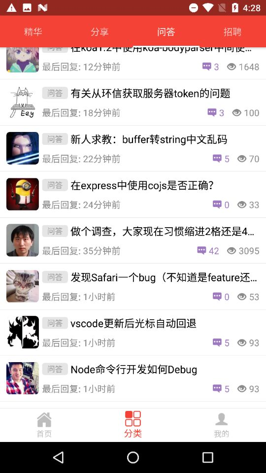
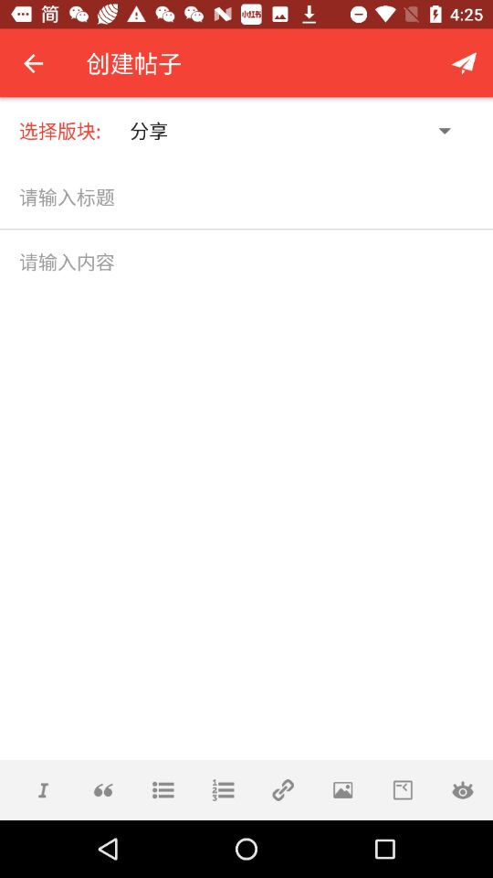
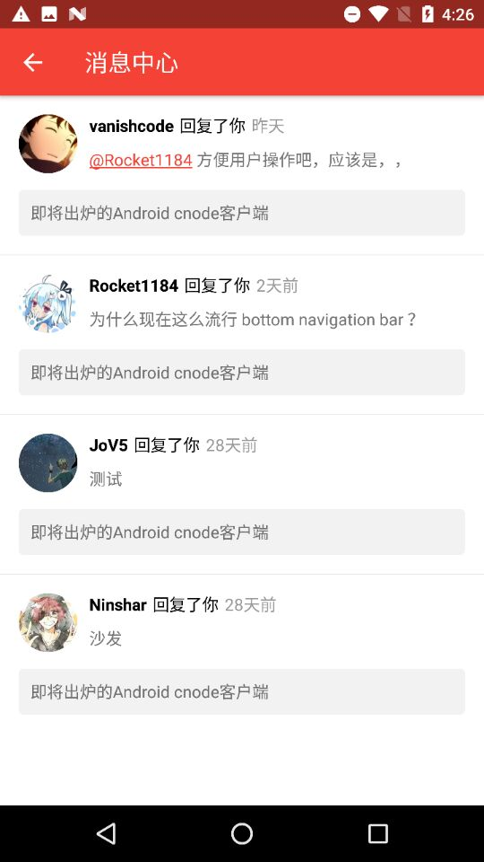
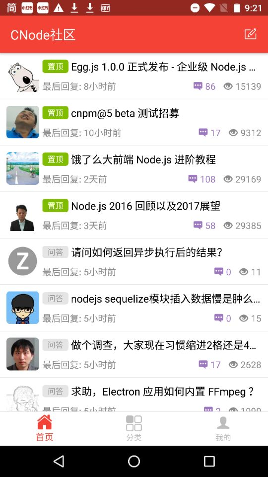
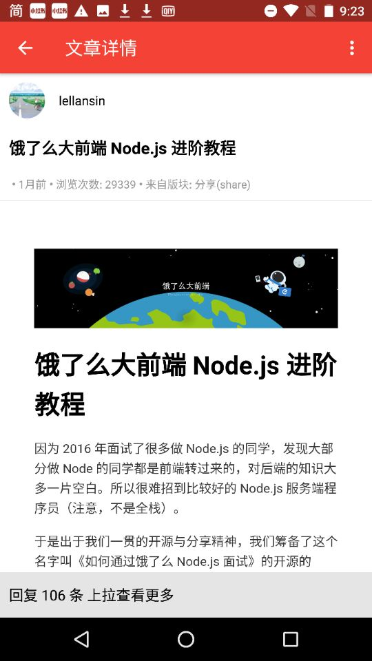
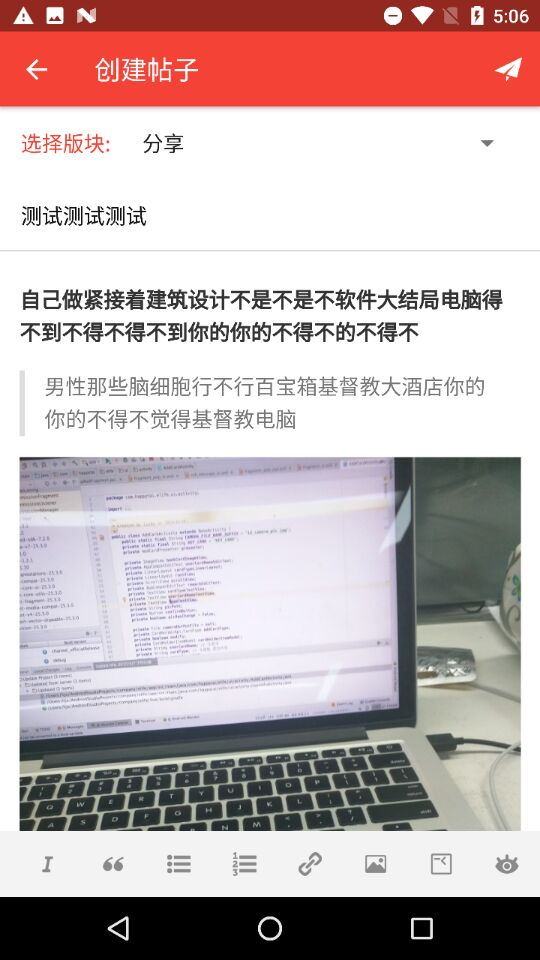
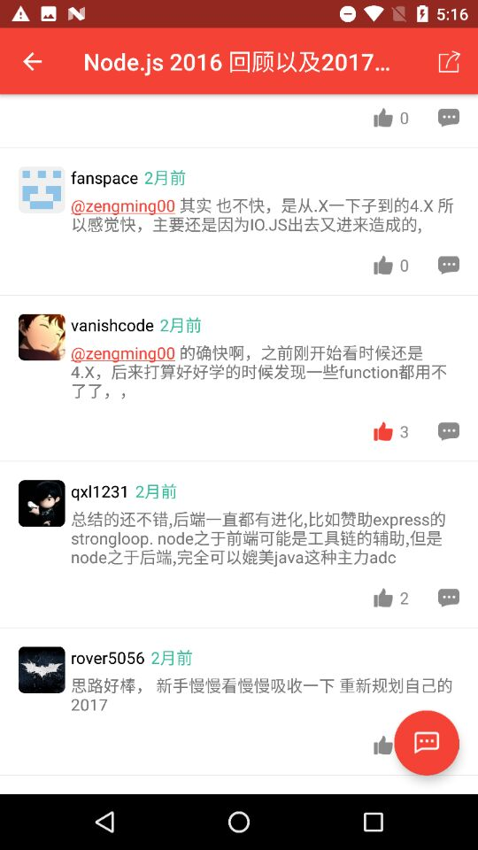

# CNode-android
a unofficial android client of [https://cnodejs.org/](https://cnodejs.org/)

# Apk Download

[https://fir.im/r26f](https://fir.im/r26f)

# Completed 

* 扫码登录功能
* 获取文章等信息并展示功能
* Markdown编辑器以及预览功能
* 发表文章和评论，以及点赞等功能
* 对Fragment的内存恢复做了处理
* 图片压缩上传

# Screenshots

# Thanks to the open source project
* [RxJava](https://github.com/ReactiveX/RxJava)
* [Butterknife](https://github.com/JakeWharton/butterknife)
* [Picasso](https://github.com/square/picasso)
* [Retrofix](https://github.com/square/retrofit)
* [RoundedImageview](https://github.com/vinc3m1/RoundedImageView)
* [Zxing-android-embedded](https://github.com/journeyapps/zxing-android-embedded)
* [Avoscloud-sdk](https://github.com/leancloud/leancloud-sdk)
* [Bilibili-Boxing](https://github.com/Bilibili/boxing)
